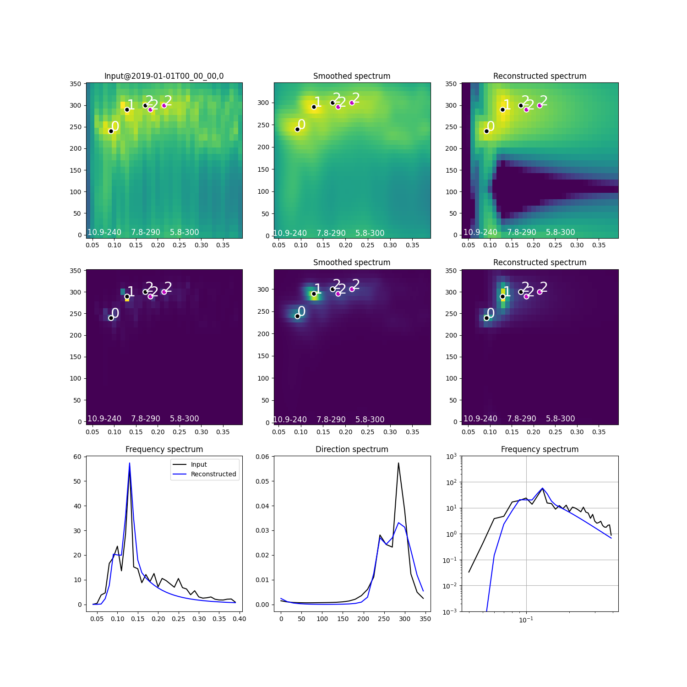

# Ocean Wave Spectra 2D Splitting/Fitting

## Introduction

The main purpose of this package is to find parameters of JONSWAP wave spectra with spreading that, when recombined,
 best match the input 2D frequency direction wave spectra.  Given a 2D wave spectrum S(f,theta), the package
 finds parameters of multiple JONSWAP partitions including wave spreading (i.e. Hs, Tp, Gamma, Tail exponent, ThetaP).  

The aim of the package is to provide an industry wide approach to derive usable wave spectral parameters that
provide the best possible reconstruction of the input wave spectrum.  The method is designed to be tunable, but
robust in the default configuration.  A large number of observed and numerically modelled datasets have been tested 
during the creation and validation of the method.

It is the intention that the package will be used by consultants and weather forecastors to improve the descriptions
of the ocean wave partitions for use in operations and engineering applications.  It provides the metocean engineer
with a robust way to separate swells and wind seas.


## Usage

Import the waveSpec class
```
# A. Make up the spectrum S(f,th)
from wavespectra2dsplitfit import waveSpec
import numpy as np
spec = waveSpec()
spec.f = np.arange(0.04,0.4,0.005)     # units in Hz
spec.th = np.arange(0,15,360)          # units in deg
spec.S = np.zeros((len(spec.f),len(spec.th))

# B. User to fill spec.S with real data with units m^2/(Hz.deg)
# spec.S = <user to assign 2D numpy array>
spec.autoCorrect()

# Setup fitting configuration - simple example with no wind (also usually best setup with no wind)
tConfig = {
    'maxPartitions': 3,
    'useClustering': True,
    'useWind': False,
    'useFittedWindSea': False,
    'useWindSeaInClustering': False,
    'doPlot': True,
    'saveFigFilename': "test.png"
}
specParms, fitStatus = spec.fit2DSpectrum(tConfig)
print(specParms, fitStatus)
```

## Example Result

Check out the test.py script as an example with data.

An example of the input and output reconstructed spectrum are shown in the image
below.


