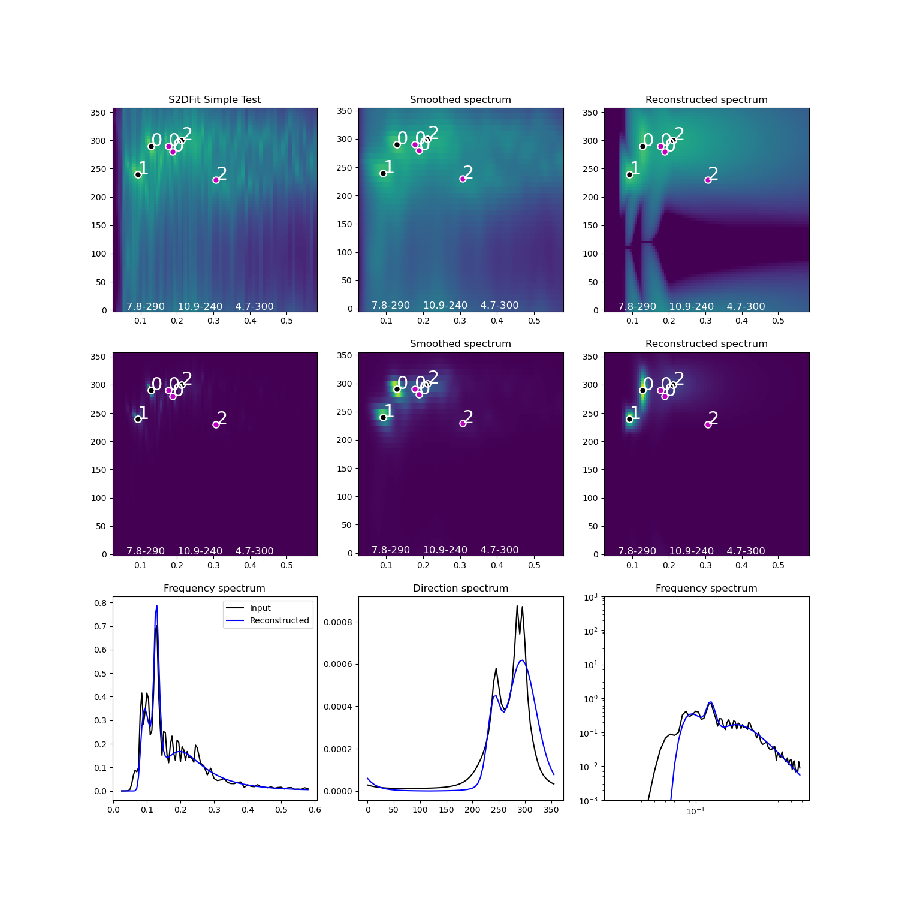

# Ocean Wave Spectra 2D Splitting/Fitting

## Introduction

The main purpose of this package is to find parameters of JONSWAP wave spectra with spreading that, when recombined,
 best match the input 2D frequency direction wave spectra.  Given a 2D wave spectrum S(f,theta), the package
 finds parameters of multiple JONSWAP partitions including wave spreading (i.e. Hs, Tp, Gamma, Tail exponent, ThetaP).  

The aim of the package is to provide an industry wide approach to derive usable wave spectral parameters that
provide the best possible reconstruction of the input wave spectrum.  The method is designed to be tunable, but
robust in the default configuration.  A large number of observed and numerically modelled datasets have been tested 
during the creation and validation of the method.

It is the intention that the package will be used by consultants and weather forecastors to improve the descriptions
of the ocean wave partitions for use in operations and engineering applications.  It provides the metocean engineer
with a robust way to separate swells and wind seas.


## Usage

Import the waveSpec class
```
import numpy as np
from wavespectra2dsplitfit.S2DFit import readWaveSpectrum_mat
filename = 'data/ExampleWaveSpectraObservations.mat'
f, th, S, sDate = readWaveSpectrum_mat(filename)
S = S * np.pi/180 # convert from m^2/(Hz.rad) to m^2/(Hz.deg)
   
# Setup fitting configuration - simple example with no wind (also usually best setup with no wind)    
tConfig = {
    'maxPartitions': 3,
    'useClustering': True,
    'useWind': False,
    'useFittedWindSea': False, 
    'useWindSeaInClustering': False,
}

# Just do the first spectrum
from wavespectra2dsplitfit.S2DFit import fit2DSpectrum
specParms, fitStatus, diagOut = fit2DSpectrum(f[0], th[0], S[0,:,:], **tConfig)
print(specParms, fitStatus)

for tSpec in specParms:
    print("===== PARTITION =====")
    print("Hs = ",tSpec[0])
    print("Tp = ",tSpec[1])
    print("Gamma = ",tSpec[2])
    print("Sigma A = ",tSpec[3])
    print("Sigma B = ",tSpec[4])
    print("Tail Exp = ",tSpec[5])
    print("ThetaP = ",tSpec[6])
print("===== FITTING OUTCOME =====")
print(f"Fitting successful: ",fitStatus[0])
print(f"RMS error of fit: ",fitStatus[1])
print(f"Number of function evalutions: ",fitStatus[2])

from wavespectra2dsplitfit.S2DFit import plot2DFittingDiagnostics
f, th, S, f_sm, th_sm, S_sm, wsMask, Tp_pk, ThetaP_pk, Tp_sel, ThetaP_sel, whichClus = diagOut
plot2DFittingDiagnostics(
    specParms, 
    f, th, S, 
    f_sm, th_sm, S_sm, 
    wsMask,
    Tp_pk, ThetaP_pk, Tp_sel, ThetaP_sel, whichClus,
    tConfig['useWind'], tConfig['useClustering'],
    saveFigFilename = 'test',  
    tag = "S2DFit Simple Test"  
)
```

## Example Result

Check out the test.py script as an example with data.

```
$ python test.py
Optimization terminated successfully.
         Current function value: 0.082135
         Iterations: 1082
         Function evaluations: 1733
[[0.5859285326910995, 4.716981132075468, 1.0000053476007895, 0.07, 0.09, -4.234276488479486, 300.0, 4.716981132075468], [0.6129423521749234, 7.812499999999995, 5.970526837658344, 0.07, 0.09, -5.140143260428807, 290.0, 7.812499999999995], [0.4047506936099149, 10.869565217391298, 1.0000041524068202, 0.07, 0.09, -15.401874257914326, 240.0, 10.869565217391298]] [True, 0.08213522716322981, 1733]
===== PARTITION =====
Hs =  0.5859285326910995
Tp =  4.716981132075468
Gamma =  1.0000053476007895
Sigma A =  0.07
Sigma B =  0.09
Tail Exp =  -4.234276488479486
ThetaP =  300.0
===== PARTITION =====
Hs =  0.6129423521749234
Tp =  7.812499999999995
Gamma =  5.970526837658344
Sigma A =  0.07
Sigma B =  0.09
Tail Exp =  -5.140143260428807
ThetaP =  290.0
===== PARTITION =====
Hs =  0.4047506936099149
Tp =  10.869565217391298
Gamma =  1.0000041524068202
Sigma A =  0.07
Sigma B =  0.09
Tail Exp =  -15.401874257914326
ThetaP =  240.0
===== FITTING OUTCOME =====
Fitting successful:  True
RMS error of fit:  0.08213522716322981
Number of function evalutions:  1733
```


An example of the input and output reconstructed spectrum are shown in the image
below.


