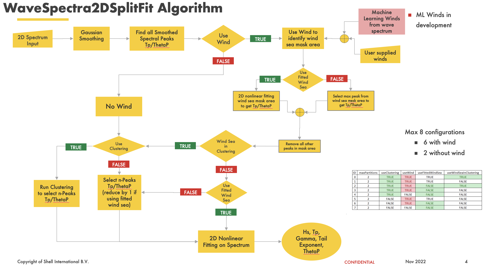

.. WaveSpectra2DSplitFit documentation master file, created by
   sphinx-quickstart on Tue Dec 20 08:10:10 2022.
   You can adapt this file completely to your liking, but it should at least
   contain the root `toctree` directive.

Welcome to WaveSpectra2DSplitFit's documentation!
=================================================

.. toctree::
   :maxdepth: 2
   :caption: Contents:

Indices and tables
==================

* :ref:`genindex`
* :ref:`modindex`
* :ref:`search`

|flowchart|

